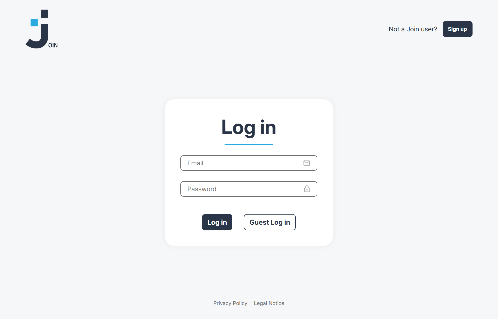
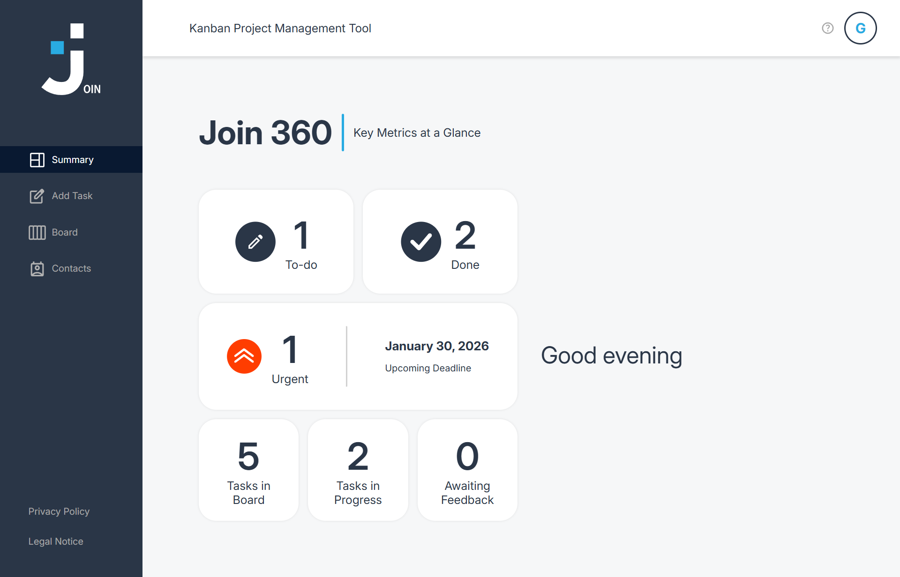
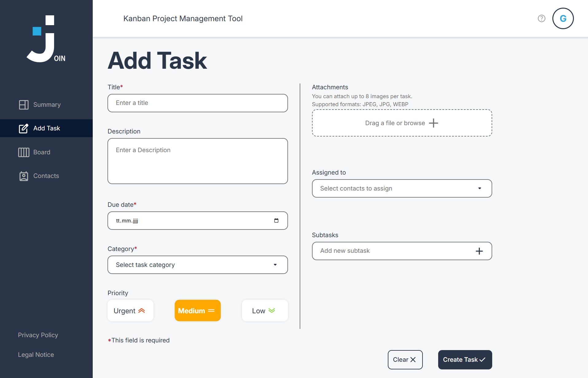
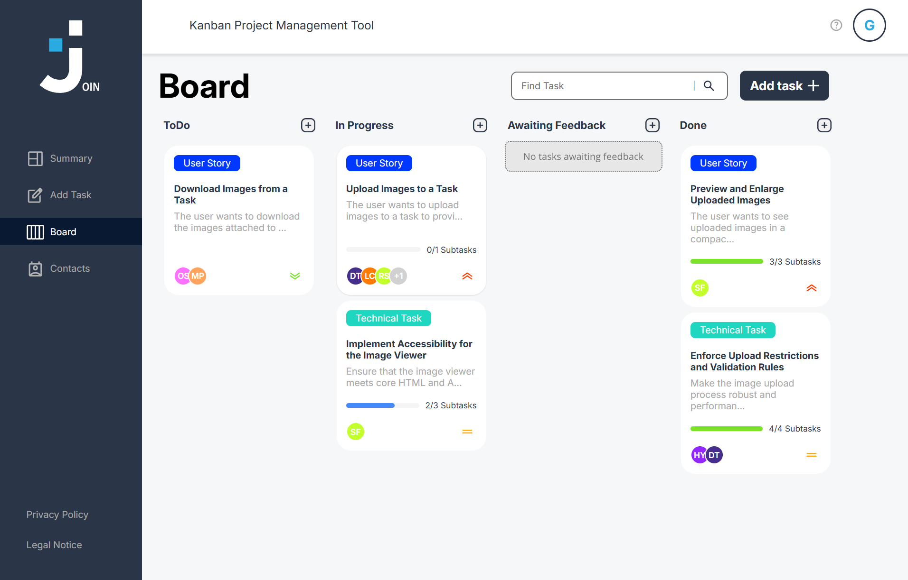
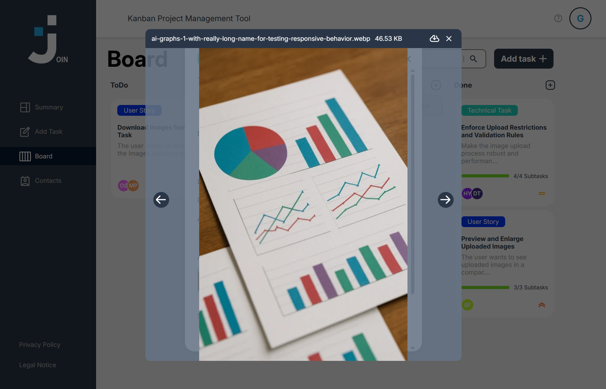
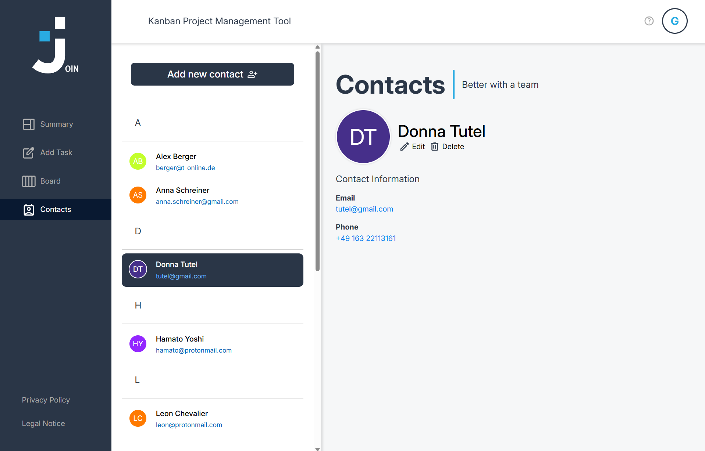

# Join

JOIN is a modern task management application inspired by Kanban boards.
It allows users to create, organize, and move tasks across different workflow states, manage contacts, and collaborate efficiently.

## Live Demo
- App: https://join.simon-fuchs.net/

## Documentation
- Compodoc: https://simcommit.github.io/join/

### Login



### Summary



### Add Task



### Board



### Image Viewer



### Contacts



<br>
<br>
<br>

# How to setup Angular

This project was generated using [Angular CLI](https://github.com/angular/angular-cli) version 19.2.13.

## Development server

To start a local development server, run:

```bash
ng serve
```

Once the server is running, open your browser and navigate to `http://localhost:4200/`. The application will automatically reload whenever you modify any of the source files.


## Building

To build the project run:

```bash
ng build
```

This will compile your project and store the build artifacts in the `dist/` directory. By default, the production build optimizes your application for performance and speed.

## Additional Resources

For more information on using the Angular CLI, including detailed command references, visit the [Angular CLI Overview and Command Reference](https://angular.dev/tools/cli) page.
